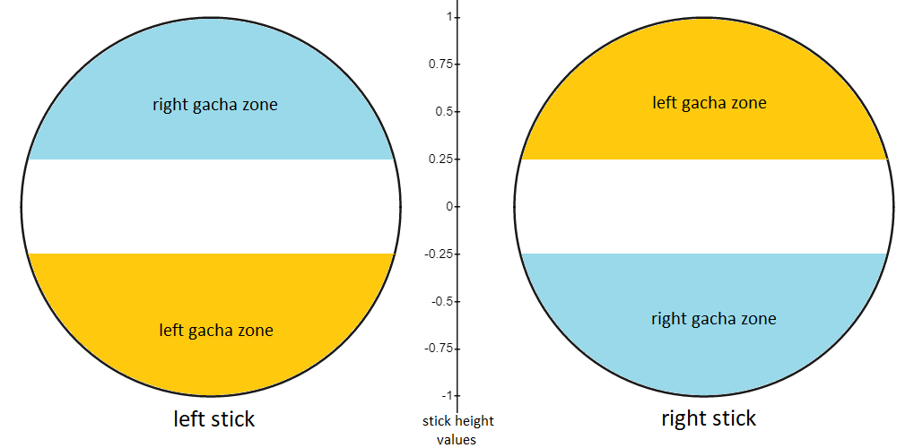

### Gachas

A **gacha** is what we call an input where one stick is up and the other is down. A **left gacha** turns left (left stick down, right stick up) and a **right gacha** turns right (left stick up, right stick down). Whether a stick is "up" or "down" depends only on its height, as shown below. 

Specifically, with analog input scaled between -1 and 1, a y-coordinate above 0.25 is an "up" input and below -0.25 is a "down" input.

A gacha occurs on the *first frame* when *both sticks* are in a gacha zone: if one stick is already up, a gacha occurs the first frame the other stick is down.

TODO: slow-motion gif of input display + y gauges captured from mod with gacha thresholds

Since you need to input multiple gachas in a row to spin and boost, the game maintains a *gacha count* to remember how many gachas you have done recently. It also maintains the *last gacha direction* so that it can make sure each gacha in the count is alternating: if your last gacha was left, the count will only increase when you do a right gacha.

TODO: slow-motion gif of gacha count + last gacha direction captured from mod

Whenever you input a gacha, the *gacha timer* starts counting down. If you don't input a gacha of the opposite direction within 12 frames (0.4 seconds), the gacha count resets to 0.

TODO: slow-motion gif of gacha count + gacha timer captured from mod

Note: the name gacha comes from the Reroll source code itself. Martini pointed out it’s a Japanese onomatopoeic word that probably refers to the clacking sound the sticks make as you boost. 

### Boosting

A **boost** occurs when you reach a specific gacha count, which changes with the katamari's size:

|  **Katamari size**  | **Gachas for a boost** |
|:-------------------:|:-------------------:|
|      Below 50cm     |          5          |
| Between 50cm and 5m |          6          |
| Between 5m and 10m  |          7          |
|      Above 10m      |          8          |

TODO: slow-motion gif of boosting at various sizes with gacha count

Your gacha count will continue increasing after you boost.

TODO: gif of spamming gachas through a boost to get 20+

The gacha timer also continues running after a boost, and when the timer hits 0 it resets your gacha count as usual.

TODO: gif of resetting gacha count out of boost by holding a turn, then snaking as usual after count resets

### Spinning

A **spin** occurs when your gacha count is 3. The spin will continue until either:

- the gacha timer hits 0 and your gacha count resets to 0, or
- your gacha count becomes high enough that you boost instead.

TODO: slow-motion gif of spin occurring with gacha count

### Boost Energy and Huffing

**Boost energy** is an invisible resource that decreases while you spin and boost. More accurately, boost energy decreases by 1 on every frame your gacha count is at least 3. 
After boosting, you will continue losing boost energy until your gacha count resets.

TODO: slow-motion gif of boost energy decreasing after spin
TODO: slow-motion gif of boost energy decreasing while spamming snakes out of a boost

If you don't use any boost energy for 100 frames (~3.33 seconds), you **recharge** 18 energy.

TODO: gif of boost recharge + boost energy meter showing multiple recharges

You start with 240 boost energy (the maximum value) and huff when you reach 0. When your boost energy reaches 0, a huff begins. A huff lasts for 240 frames (8 seconds). During the huff, all gacha inputs are ignored. When the huff ends, your boost energy is reset to 240.

TODO: gif of boost energy hitting 0 showing full duration of huff, and boost energy being 240 after.

### Resetting Gacha Count for Efficient Boosts

After boosting, your boost energy stops decreasing (and starts recharging) once your gacha count resets. Therefore, manipulating a gacha count reset as soon as possible after boosting will save boost energy.

The easiest way to reset gacha count is to let the gacha timer hit 0 (by not doing a new gacha for 0.4 seconds), but resetting the timer without losing a lot of speed can be tricky. Depending on the line you want to take, you can either briefly stop snaking or pinch for that time. 

TODO: slow-motion gif of mas7 pinch

TODO: slow-motion gif of holding a turn to reset gacha count

The gacha count also resets when you:

- become airborne, or
- collide with anything you can't pick up.

These mechanics can be exploited during specific boosts to minimize energy loss.

TODO: slow-motion gif of losing gacha count from mas6 crate boost and going over mas8 sandbox

TODO: slow-motion gif of losing gacha count colliding with wall after mas8 cream puff boost, then gacha count resetting again after boosting over incline towards milk bottles
